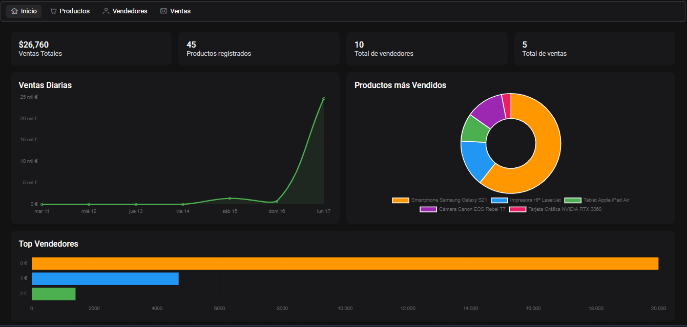
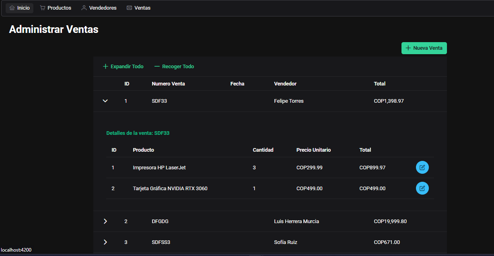
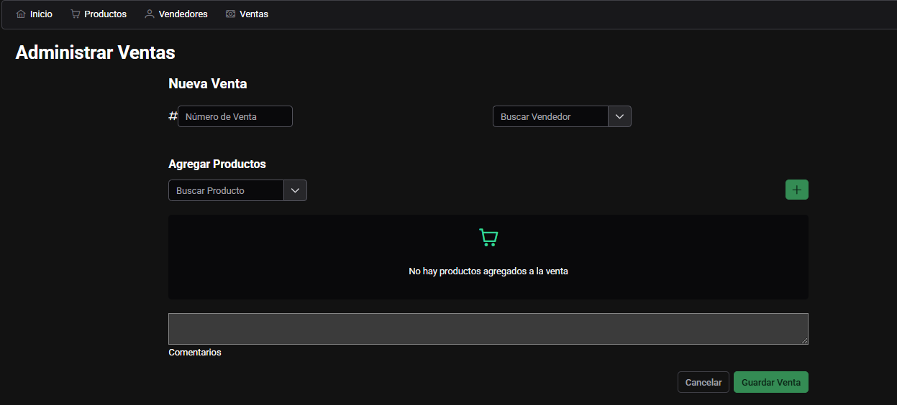

# Sales Management System Frontend

A modern web application built with Angular 19.1.7 for managing sales and sellers. This system provides an intuitive interface for tracking sales transactions and managing seller information.



## Features

- Sales Management
- Seller Registration and Management
- Transaction History
- Real-time Data Updates




## Prerequisites

Before you begin, ensure you have installed:
- Node.js (v18 or higher)
- npm (v9 or higher)
- Angular CLI (v19.1.7)

## Getting Started

1. Clone the repository:
```bash
git clone <repository-url>
cd frontend
```

2. Install dependencies:
```bash
npm install
```

3. Start the development server:
```bash
npm start
```

The application will be available at [http://localhost:4200](http://localhost:4200)

## Environment Setup

The application requires a backend API connection. Make sure to configure the environment variables in:
```bash
src/environments/environment.development.ts
```

## Build for Production

To create a production build:
```bash
npm run build
```

The build artifacts will be stored in the `dist/frontend` directory.

## Technologies

- Angular 19.1.7
- RxJS
- SCSS
- Angular Material

## Project Structure

```
frontend/
├── src/
│   ├── app/
│   │   ├── sale/         # Sales module
│   │   ├── seller/       # Sellers module
│   │   ├── product/      # Products module
│   │   └── shared/       # Shared components
│   ├── assets/
│   └── environments/
└── public/
    └── assets/           # Public images and resources
```
```

## Contributing

1. Fork the repository
2. Create your feature branch (`git checkout -b feature/AmazingFeature`)
3. Commit your changes (`git commit -m 'Add some AmazingFeature'`)
4. Push to the branch (`git push origin feature/AmazingFeature`)
5. Open a Pull Request

## License

This project is licensed under the MIT License - see the LICENSE file for details.
